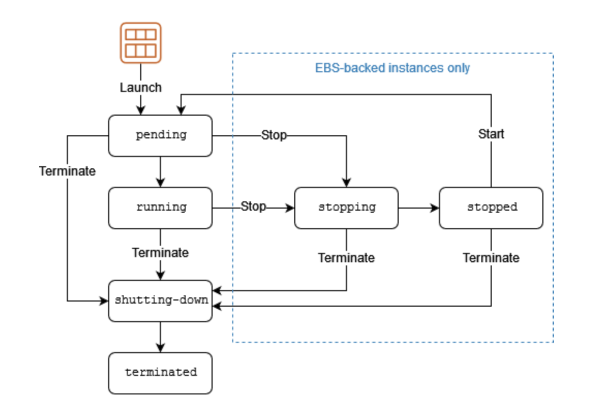
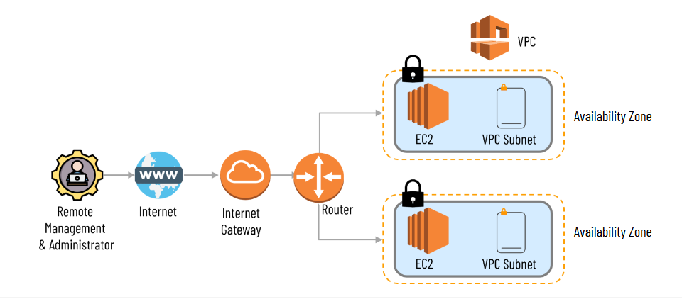

# AWS Cloud Technical Essentials
The AWS Cloud Technical Essentials course introduces newcomers to core AWS principles, services, and cloud computing basics. It provides foundational knowledge of key AWS services and best practices, preparing participants for further exploration of AWS solutions.
  

## Skills Covered
* Build a strong foundation in AWS cloud services like compute, networking, storage, and databases.
* Get hands-on practice with provisioning, configuring, and managing resources via the AWS Management Console.
* Discover best practices for designing secure, scalable, and cost-effective cloud architectures.
* Develop skills to monitor, optimize, and troubleshoot AWS environments for peak performance and efficiency.
* Explore serverless computing, including AWS Lambda and Amazon API Gateway.
  

## Module 01: Introduction to Amazon Web Services
### Lesson 1.1: Introduction to AWS Cloud
**Amazon Web Services** provides a wide range of global cloud-based products, including compute, storage, databases, analytics, networking, mobile, developer tools, management tools, IoT, security, and enterprise applications. These services are on-demand, accessible in seconds, and follow a pay-as-you-go pricing model. The cloud model includes five essential characteristics, three service types, and four deployment models.

**Essential Chrematistics** 
* Broad Network Access
* Rapid Elasticity
* Measured Service (For pay-as-you-go basis)
* On-Demand Self-Service
* Resource Pooling

**Service Models**
* Software as a Service (SaaS)
* Platform as a Service (PaaS)
* Infrastructure as a Service (IaaS)

**Deployment Models** 
* Public
* Private
* Hybrid
* Community

**AWS Global Infrastructure** - AWS Cloud spans 108 Availability Zones within 34 geographic regions, with announced plans for 18 more Availability Zones and six more AWS Regions in Mexico, New Zealand, the Kingdom of Saudi Arabia, Thailand, Taiwan, and the AWS European Sovereign Cloud.
* AWS Region - separate geographic area
* AWS Availability Zone - a distinct data center within a region. While an AZ may contain multiple data centers, they are located close enough to function as a single AZ.
 

### Lesson 1.2: AWS Identity Access Management (IAM)
**AWS Identity and Access Management (IAM)** is a web service provided by Amazon Web Services (AWS) that allows you to manage access to AWS resources securely.
* Access Management
* User Group
    * One user can assigned multiple group
    * Sub-group not allow
* Users
    * Create User
    * Change Password: Security Credentials -> Update Console Password
    * Set MFA (Multi-factory Authenticator)
* Roles
    * Use to communicate each other between different services or same service with different regions
* Policies
    * Policies can be set per User or User Group
    * Direct Managed: A huge pre-defined policies available
    * Customer Managed: Can create custom policy
* Dentity Providers
* Account Setting
    * Change Password Policy
  

## Module 02: AWS Compute
### Lesson 2.1: Introduction to Amazon Elastic Compute Cloud (EC2)
**AWS EC2** - is a web service that provides resizable compute capacity in the cloud. In other words virtual machine in the AWS Cloud environment. It reduces the time required to obtain and start the new server in a minute.

**Benefites of AWS EC2**
* Scalability
* Flexibility and Variety
* Elasticity
* Reliability
* Security
* Cost Efficiency
* Security Group
    * Inbound Rule
    * Outbound Rule

**Pricing Options of AWS EC2**
* On-Demand - Pay by the hour or second basis
* Reserved - Time limit 1 or 3 years contracts up to 70% discount
* Spot - Price based on bargading of up to 90% discount
* Dedicated Host - physical EC2 server is dedicated for our use. Most expensive option.

### Lesson 2.2: Introduction Amazon EC2 Instance Lifecycle

  

### Lesson 2.3: What is Serverless?
**Serverless** architecture is a way to build and run applications and services without having to manage infrastructure. Your application still runs on servers, but all the server management is done by AWS

**Benefites of Serverless**
* Fully managed service
* Scale Flexiby
* Only pay for resources you use
* Enhance Developer productivity
* Seamless Connections
* Develop Intelligent applications

**Example of Serverless Services**
* AWS Lambda - Enables you to run code without provisioning or managing servers.
* AWS App Runner - Makes it easy to build, deploy, and scale web applications quickly.
* AWS Fargate - Allows you to run containers without having to manage the underlying infrastructure
  

### Lesson 2.4: Introduction to AWS Lambda
**Where to Use** - You can run code for virtually any type of application or backend service. This includes:
* Data Processing
* Real-time Stream Processing
* Machine Learning
* WebSocket
* IoT Backends
* Mobile Backends
* Web Applications

**How AWS Lambda works** - There are options for configuring Lambda functions using the Lambda console, Lambda API, AWS CloudFormation, or AWS Serverless Application Model (AWS SAM).
* Function
* Tigger
* Event
* Application Environment
* Deployment Packages
* Runtime

### Lesson 2.5: Choose the Right Computing Service
* **Amazon EC2**: Virtual servers in the cloud for running applications
* **AWS Lambda**: Serverless computing for event-driven applications.
* **Amazon ECS (Elastic Container Service)**: Container orchestration service for managing Docker containers
* **Amazon EKS (Elastic Kubernetes Service)**: Managed Kubernetes service for container orchestration.
* **AWS Fargate**: Serverless compute engine for containers.
* **AWS Elastic Beanstalk**: Fully managed platform-as-a-service (PaaS) for application deployment.
* **Amazon LightSail**: Simple virtual private servers with pre-configured options.
  

## Module 03: AWS Networking
### Lesson 3.1: Networking in AWS
**Networking in Amazon Web Services (AWS)** includes designing, configuring, and managing infrastructure that connects AWS services and resources. AWS offers various networking services and features to support scalable, secure, and high-performance applications. Key components include:
* **Amazon Virtual Private Cloud (VPC)** - VPC is a logically isolated section of the AWS Cloud where you can launch AWS resources.
* **VPC Subnets** - VPC Subnets are divisions within a VPC that allow you to organize resources. They are associated with a specific availability zone (AZ) in a region.
* **Route Tables** - Route Tables contains a set of rules, called routes, that are used to determine where network traffic is directed.
* **Internet Gateway** - Internet Gateway enables communication between instances in your VPC and the internet. It serves as a horizontally scaled, redundant component.
* **Amazon Route 53** - Route 53 is a scalable and highly available domain name system (DNS) web service. It translates user-friendly domain names into IP addresses.
* **Virtual Private Network (VPN) and Direct Connect** - VPN and Direct Connect services provide secure and dedicated network connections between your on-premises data center and your VPC.
* **Security Group and Network ACL** - Security Group act as virtual firewalls for your instances, controlling inbound and outbound traffic. Network ACL are stateless and operate at the subnet level.
 

### Lesson 3.2: Introduction to Amazon Virtual Private Cloud (Amazon VPC)
**Amazon Virtual Private Cloud (VPC)** gives you full control over your virtual networking environment, including resource placement, connectivity, and security. Get started by setting up your VPC in the AWS service console.
* Selection of your own IP address range
* Creation of subnets
* Configuration of route tables and network gateways

### Lesson 3.3: Amazon VPC Routing
**Amazon VPC routing** is a crucial aspect of networking within AWS. It involves configuring the rules that determine how traffic flows between different components within the VPC, such as subnets, instances, and the internet.

### Lesson 3.4: Amazon VPC Security
**Amazon VPC Security** is a critical aspect of AWS networking, focusing on safeguarding resources within the VPC and controlling access to and from external networks.
  

## Module 04: AWS Storage
### Lesson 4.1: AWS Storage Types
**AWS Storage Overview** - AWS Storage services are grouped into three categories:
* **File Storage**: In file storage, data is stored as files in a hierarchy using file sharing protocol. Ex - Amazon EFS (Elastic File Storage)
* **Block Storage**: In block storage, data is stored in fixed-size blocks. Ex - Amazon EBS (Elastic Block Service), Amazon EC2 (Instance Store)
* **Object Storage**: In object storage, data is stored as objects in buckets. Ex - Amazon S3, Amazon Glacier
 

### AWS Storage Types
* **File Storage** is ideal when you require centralized access to files that must be easily shared and managed by multiple host computers.
Typically, this storage is mounted onto multiple hosts, and requires file locking and integration with existing file system communication
protocols.
    * **Elastic File System (EFS)**: Centralized file storage for Linux and Unix systems, facilitating collaboration with multi-host mounting and standard protocol integration.
    * **Amazon FSx for Windows**: Tailored for Windows environments, providing efficient centralized file management for Windows applications and storage needs.
    * **Amazon FSx for Lustre**: Designed for Unix-based systems, offering high-performance file storage ideal for HPC workloads, machine learning, and analytics.
* **AWS Block Storage** is a technology that controls data storage and storage devices. It takes any data, like a file or database entry, and
divides it into blocks of equal sizes. The block storage system then stores the data block on underlying physical storage in a manner that is optimized for fast access and retrieval.
    * **Amazon Elastic Block Store (EBS)**: Provides block-level storage volumes for use with Amazon EC2 instances.
    * **Amazon EC2 instance storage**: Storage directly attached to EC2 instances.
* **AWS Object Storage**, files are stored as objects. Objects, much like files, are treated as a single, distinct unit of data when stored. However, unlike file storage, these objects are stored in a bucket using a flat structure, meaning there are no folders, directories, or complex hierarchies.
    * **AWS S3** provides efficient object storage with a flat structure, offering scalability, accessibility, and versatility for diverse storage needs.

### Lesson 4.2: Amazon EC2 Instance Storage and Amazon Elastic Block Storage

        
## AWS Keywords
* AWS Region - separate geographic area
* AWS Availability Zone - Availability Zone as data center. A availability zone may have multiple data center but because the are close together, they counted as 1 Availability Zone.
* AWS CloudFront -> Cache provides, CDN services
* AWS Edge Location -> Location of CloudFront
* AWS EC2 - Amazon Elastic Compute Cloud (EC2)

