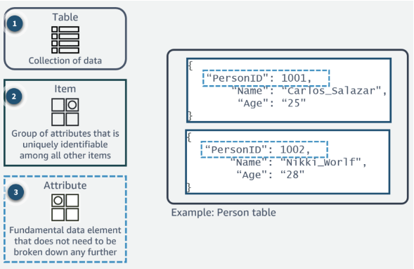

# AWS Cloud Technical Essentials
The AWS Cloud Technical Essentials course introduces newcomers to core AWS principles, services, and cloud computing basics. It provides foundational knowledge of key AWS services and best practices, preparing participants for further exploration of AWS solutions.
  

## Skills Covered
* Build a strong foundation in AWS cloud services like compute, networking, storage, and databases.
* Get hands-on practice with provisioning, configuring, and managing resources via the AWS Management Console.
* Discover best practices for designing secure, scalable, and cost-effective cloud architectures.
* Develop skills to monitor, optimize, and troubleshoot AWS environments for peak performance and efficiency.
* Explore serverless computing, including AWS Lambda and Amazon API Gateway.
  

## Module 01 : Introduction to Amazon Web Services
### Lesson 1.1 : Introduction to AWS Cloud
**Amazon Web Services** provides a wide range of global cloud-based products, including compute, storage, databases, analytics, networking, mobile, developer tools, management tools, IoT, security, and enterprise applications. These services are on-demand, accessible in seconds, and follow a pay-as-you-go pricing model. The cloud model includes five essential characteristics, three service types, and four deployment models.

**Essential Chrematistics** 
* Broad Network Access
* Rapid Elasticity
* Measured Service (For pay-as-you-go basis)
* On-Demand Self-Service
* Resource Pooling

**Service Models**
* Software as a Service (SaaS)
* Platform as a Service (PaaS)
* Infrastructure as a Service (IaaS)

**Deployment Models** 
* Public
* Private
* Hybrid
* Community

**AWS Global Infrastructure** - AWS Cloud spans 108 Availability Zones within 34 geographic regions, with announced plans for 18 more Availability Zones and six more AWS Regions in Mexico, New Zealand, the Kingdom of Saudi Arabia, Thailand, Taiwan, and the AWS European Sovereign Cloud.
* **AWS Availability Zone** : An Availability Zone (AZ) functions like a data center. An AZ may contain multiple data centers, but they are grouped as one AZ due to their proximity.
* **AWS Region** : A Region is a distinct geographic area, consisting of at least two Availability Zones.
* **Edge Locations** : Edge locations support AWS's CDN service, Amazon CloudFront, by caching and delivering content with low latency from the location closest to the user.

### Lesson 1.2 : AWS Identity Access Management (IAM)
**AWS Identity and Access Management (IAM)** is a web service provided by Amazon Web Services (AWS) that allows you to manage access to AWS resources securely.
* Access Management
* User Group
    * One user can assigned multiple group
    * Sub-group not allow
* Users
    * Create User
    * Change Password: Security Credentials -> Update Console Password
    * Set MFA (Multi-factory Authenticator)
* Roles
    * Use to communicate each other between different services or same service with different regions
* Policies
    * Policies can be set per User or User Group
    * Direct Managed: A huge pre-defined policies available
    * Customer Managed: Can create custom policy
* Dentity Providers
* Account Setting
    * Change Password Policy
  

## Module 02 : AWS Compute
### Lesson 2.1 : Introduction to Amazon Elastic Compute Cloud (EC2)
**AWS EC2** is a web service that offers resizable compute capacity in the cloud, essentially functioning as a virtual machine in the AWS environment. It minimizes the time needed to provision and launch a new server to just minutes.

**Benefites of AWS EC2**
* Scalability
* Flexibility and Variety
* Elasticity
* Reliability
* Security
* Cost Efficiency
* Security Group
    * Inbound Rule
    * Outbound Rule

**Pricing Options of AWS EC2**
* On-Demand - Pay by the hour or second basis
* Reserved - Time limit 1 or 3 years contracts up to 70% discount
* Spot - Price based on bargading of up to 90% discount
* Dedicated Host - physical EC2 server is dedicated for our use. Most expensive option.

### Lesson 2.2 : Introduction Amazon EC2 Instance Lifecycle

### Lesson 2.3 : What is Serverless?
**Serverless** architecture allows you to build and run applications without managing infrastructure. Although your application runs on servers, AWS handles all server management for you.

**Benefites of Serverless**
* Fully managed service
* Scale Flexiby
* Only pay for resources you use
* Enhance Developer productivity
* Seamless Connections
* Develop Intelligent applications

**Example of Serverless Services**
* AWS Lambda - Enables you to run code without provisioning or managing servers.
* AWS App Runner - Makes it easy to build, deploy, and scale web applications quickly.
* AWS Fargate - Allows you to run containers without having to manage the underlying infrastructure

### Lesson 2.4 : Introduction to AWS Lambda
**Where to Use** - You can run code for virtually any type of application or backend service. This includes:
* Data Processing
* Real-time Stream Processing
* Machine Learning
* WebSocket
* IoT Backends
* Mobile Backends
* Web Applications

**How AWS Lambda works** - There are options for configuring Lambda functions using the Lambda console, Lambda API, AWS CloudFormation, or AWS Serverless Application Model (AWS SAM).
* Function
* Tigger
* Event
* Application Environment
* Deployment Packages
* Runtime

### Lesson 2.5 : Choose the Right Computing Service
* **Amazon EC2**: Virtual servers in the cloud for running applications
* **AWS Lambda**: Serverless computing for event-driven applications.
* **Amazon ECS (Elastic Container Service)**: Container orchestration service for managing Docker containers
* **Amazon EKS (Elastic Kubernetes Service)**: Managed Kubernetes service for container orchestration.
* **AWS Fargate**: Serverless compute engine for containers.
* **AWS Elastic Beanstalk**: Fully managed platform-as-a-service (PaaS) for application deployment.
* **Amazon LightSail**: Simple virtual private servers with pre-configured options.
  

## Module 03 : AWS Networking
### Lesson 3.1 : Networking in AWS
**Networking in Amazon Web Services (AWS)** includes designing, configuring, and managing infrastructure that connects AWS services and resources. AWS offers various networking services and features to support scalable, secure, and high-performance applications. Key components include:
* **Amazon Virtual Private Cloud (VPC)** - VPC is a logically isolated section of the AWS Cloud where you can launch AWS resources.
* **VPC Subnets** - VPC Subnets are divisions within a VPC that allow you to organize resources. They are associated with a specific availability zone (AZ) in a region.
* **Route Tables** - Route Tables contains a set of rules, called routes, that are used to determine where network traffic is directed.
* **Internet Gateway** - Internet Gateway enables communication between instances in your VPC and the internet. It serves as a horizontally scaled, redundant component.
* **Amazon Route 53** - Route 53 is a scalable and highly available domain name system (DNS) web service. It translates user-friendly domain names into IP addresses.
* **Virtual Private Network (VPN) and Direct Connect** - VPN and Direct Connect services provide secure and dedicated network connections between your on-premises data center and your VPC.
* **Security Group and Network ACL** - Security Group act as virtual firewalls for your instances, controlling inbound and outbound traffic. Network ACL are stateless and operate at the subnet level.

### Lesson 3.2 : Introduction to Amazon Virtual Private Cloud (Amazon VPC)
**Amazon Virtual Private Cloud (VPC)** gives you full control over your virtual networking environment, including resource placement, connectivity, and security. Get started by setting up your VPC in the AWS service console.
* Selection of your own IP address range
* Creation of subnets
* Configuration of route tables and network gateways

### Lesson 3.3 : Amazon VPC Routing
**Amazon VPC routing** is a crucial aspect of networking within AWS. It involves configuring the rules that determine how traffic flows between different components within the VPC, such as subnets, instances, and the internet.

### Lesson 3.4 : Amazon VPC Security
**Amazon VPC Security** is a critical aspect of AWS networking, focusing on safeguarding resources within the VPC and controlling access to and from external networks.
  

## Module 04 : AWS Storage
### Lesson 4.1 : AWS Storage Overview
AWS Storage services are grouped into three categories:
* **File Storage**: In file storage, data is stored as files in a hierarchy using file sharing protocol. Ex - Amazon EFS (Elastic File Storage)
* **Block Storage**: In block storage, data is stored in fixed-size blocks. Ex - Amazon EBS (Elastic Block Service), Amazon EC2 (Instance Store)
* **Object Storage**: In object storage, data is stored as objects in buckets. Ex - Amazon S3, Amazon Glacier

### AWS Storage Types
* **File Storage** is ideal for centralized access to files that need to be shared and managed across multiple hosts. It often requires file locking and integration with existing file system protocols.
    * **Elastic File System (EFS)** : Centralized file storage for Linux and Unix systems, supporting multi-host mounting and standard protocol integration.
    * **Amazon FSx for Windows** : Tailored for Windows environments, providing efficient file management for Windows applications.
    * **Amazon FSx for Lustre** : High-performance file storage designed for Unix-based systems, ideal for HPC workloads, machine learning, and analytics.
* **AWS Block Storage** divides data into equal-sized blocks for optimized storage and fast retrieval. Examples include:
    * **Amazon Elastic Block Store (EBS)** : Provides block-level storage for EC2 instances.
    * **Amazon EC2 Instance Storage** : Directly attached storage for EC2 instances.
* **AWS Object Storage** stores data as objects in a flat structure, without directories or complex hierarchies.
    * **Amazon S3** : Offers scalable, accessible, and versatile object storage, ideal for diverse storage needs.

### Lesson 4.2 : Amazon EC2 Instance Storage and Amazon Elastic Block Storage
**Amazon EC2 Instance Store** provides temporary block-level storage for an EC2 instance, located on disks physically attached to the host computer. This storage is ephemeral and is lost when the instance is stopped or terminated.

**Amazon Elastic Block Store (EBS)** offers block-level storage that can be attached to an EC2 instance, similar to attaching an external drive to a laptop. EBS volumes are persistent, meaning data remains even if the EC2 instance is stopped or restarted, making them useful for long-term storage.

**Use Case of EC2 Instance Storage**
* Instance Store is ideal for applications that replicate data to other EC2 instances, like Hadoop clusters. The speed of locally attached storage combined with replicated data ensures high performance and efficient data distribution for cluster-based workloads.
* It is also suitable for temporary storage of frequently changing data, such as buffers, caches, scratch data, and other transient content.

**Use Case of EBS**
**Amazon EBS** is ideal for scenarios where you need quick data retrieval and long-term persistence. Common use cases include:
* **Boot and Root Volumes**: Used to store the operating system of an EC2 instance.
* **Storage for Databases**: Provides scalable, consistent, and low-latency storage for databases running on EC2, ensuring performance aligns with your needs.

### Lesson 4.3 : Object Storage with Amazon S3
**Amazon S3 or Amazon Simple Storage Service Object** - storage is built for the cloud and delivers virtually unlimited scalability, high durability, and cost effectiveness
* It provides developers and IT teams with secure, durable, highly scalable object storage
* It S3 is easy to use, the simple web services interfaces to store and retrieve any amount of data from anywhere on the web
* It allows us to upload our files
* File can be 0 Byte to 5 TB
* Unlimited Storage
* File stored in Bucket
* Return 200 codes if uploaded successfully

### Lesson 4.4 : Purpose Driven Right Storage Selection
* **Amazon EC2 instance store**
    * Caching and Buffers
    * Temporary Data and Scratch Space
    * Stateless Applications
* **Amazon EBS**
    * Root Volume for EC2 Instances
    * Applications and Database Storage
    * Backup and Snapshots
* **Amazon S3**
    * Data Storage, Backup and long-time archiving
    * Media and Web Object Content
    * Static Website Hosting
* **Amazon EFS**
    * Shared File Storage for EC2 Instances
    * Big Data and Analytics
    * Container Storage for Docker and Kubernetes
  

## Module 05 : Databases
### Lesson 5.1 : Explore Databases in AWS

**AWS Database Overview** - A high-performing database is crucial to any organization. Databases support the internal operations of companies and store interactions with customers and suppliers
* **Amazon RDS** - Managed Relational Database Service ex: Oracle, MSSQL, PostgreSQL, MariaDB
* **Amazon DocumentDB** - Fully-managed MongoDB-compatible Database
* **Amazon DynamoDB** - Managed NoSQL Database
* **ElastiCache** - In-Memory Cache

### Lesson 5.2 : Amazon Relational Database Service (RDS)
**Amazon Relational Database Service (RDS)** allows you to focus on your application's unique features rather than infrastructure tasks like provisioning, patching, scaling, and restoring. As a managed database service, Amazon RDS enables customers to create and manage relational databases in the cloud, removing the operational burdens of traditional database management.
* **Commercial** : Oracle, SQL Server, IBM Db2
* **Open source** : MySQL, PostgreSQL, MariaDB
* **Cloud native** : Aurora

More Details on Amazon Relational Database Service (RDS)
* Database Instances Type
    * Standard classes
    * Memory optimized classes
    * Burstable Classes
* Storage on Amazon RDS
    * GP2 ( SSD)
    * GP3 (SSD)
    * IOPS io1 (SSD)
    * Magnetic
* DB Auto Backup
    * Default 1 to 35 days

### Lesson 5.3 : Amazon Introduction to Amazon DynamoDB
DynamoDB is a fully managed NoSQL database service that provides fast and predictable performance with seamless scalability

* **Components**
    * In AWS DynamoDB, tables, items, and attributes are the core components that you work with.
    * A table is a collection of items, and each item is a collection of attributes
    * 
* **Use Cases**
    * DynamoDB is a fully managed service that handles the operations
work. You can offload the administrative burdens of operating and
scaling distributed databases to AWS

### Lesson 5.4 : Choose the Right AWS Database Service